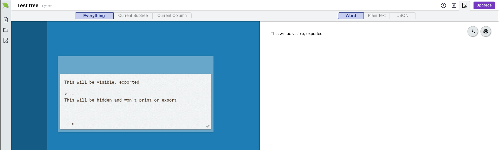
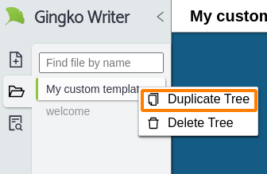

# FAQ

## How do I delete a tree?

Right click on the tree name in the left-sidebar, and then click "Delete Tree"

## How do I insert images?

At the moment, you'll have to insert them manually by providing a URL, like this:\
``

To get a link like that from a DropBox image, for example, you need to [create a link](https://help.dropbox.com/files-folders/share/view-only-access) and the add `?raw=1` to the end of it (otherwise you're linking to a preview page, rather than the image itself):\
``

Sorry, I know it's a lot of steps at the moment!

## How do I hide things from print & export?

Use `<!--` and `-->`. Everything between those two symbols in any card will be hidden when you print/export.

## How do I invite collaborators to my documents?

Gingko Writer doesn't support collaboration yet. If this is a needed feature, you can still use the legacy https://gingkoapp.com version for collaboration and tree-sharing.

I am looking forward to adding collaboration to Gingko Writer, but I don't have an estimate on how long it'll take me. I won't disable the old version until well after collaboration is added to the new one though.

## LaTeX support : is it available?

Gingko Writer doesn't support LaTeX yet. If this is a needed feature, you can still use the legacy https://gingkoapp.com version for LaTeX documents.

I am looking forward to adding LaTeX to Gingko Writer, but I don't have an estimate on how long it'll take me. I won't disable the old version until well after it's is added to the new one though.

## How do I make my own custom templates?

Simply right-click on the tree you want to use as a template, and then click "Duplicate Tree":

## Why is my text doubled when I save?

If you're using **Grammarly**, then you may experience doubled-up text in Gingko Writer. This issue comes and goes with different versions of Grammarly, so if it's happening to you, you might have to disable Grammarly on gingkowriter.com for a time, by following these instructions:


