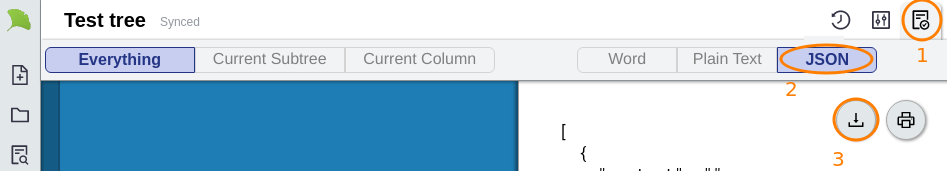

# FAQ

## How do I move my documents from v1 to the new version?

1. Click on the "File" button at top left:   
2. Click on "New" and then "From Old Account":   

## Why is my text doubled when I save?

If you're using **Grammarly**, then you may experience doubled-up text in Gingko Writer. I'd like to find a fix, but in the meantime, you can disable Grammarly on gingkowriter.com by following these instructions:



## How do I insert images?

At the moment, you'll have to insert them manually by providing a URL, like this:  
``

To get a link like that from a DropBox image, for example, you need to [create a link](https://help.dropbox.com/files-folders/share/view-only-access) and the add `?raw=1` to the end of it \(otherwise you're linking to a preview page, rather than the image itself\):  
``

Sorry, I know it's a lot of steps at the moment!

## How do I hide things from print & export?

Use `<!--` and `-->`. Everything between those two symbols in any card will be hidden when you print/export.

## How do I invite collaborators to my documents?

Gingko Writer doesn't support collaboration yet. If this is a needed feature, you can still use the legacy https://gingkoapp.com version for collaboration and tree-sharing.

I am looking forward to adding collaboration to Gingko Writer, but I don't have an estimate on how long it'll take me. I won't disable the old version until well after collaboration is added to the new one though.

## How do I make my own custom templates?

If you want to create your own starting point for a type of document, the simplest way is to:

1. Export your template/starting document as JSON.

2. Import it whenever you want to use it as a template.

## When will the old/legacy version be shut down?

There is no firm date for the shutdown of gingkoapp.com, but rest assured that there will be _many_ reminders and opportunities to move your data to the new version.

