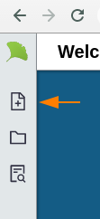

# Gingko Versions (v1, Desktop)

## How do I move my documents from v1 to the new version?

1. Click on the "File" button at top left:\
   &#x20;&#x20;
2. Click on "New" and then "From Old Account":\
   &#x20;&#x20;

(Note that for some very large trees, you might have to do this instead: "Export to JSON" in v1, and "Import JSON tree" in v2)

## When will the old/legacy version be shut down?

There is no firm date for the shutdown of gingkoapp.com, but rest assured that there will be _many_ reminders and opportunities to move your data to the new version.

## What about the desktop version?

I hope to bring the desktop version (still [available here](https://github.com/gingko/client/releases)), up to date with the latest web version _eventually_.

But I've had to put it on the back-burner for some time now. If you _really_ need to have the desktop version updated, **contact me**. Knowing how your how your use case is not covered by the web app will help me in prioritizing.
